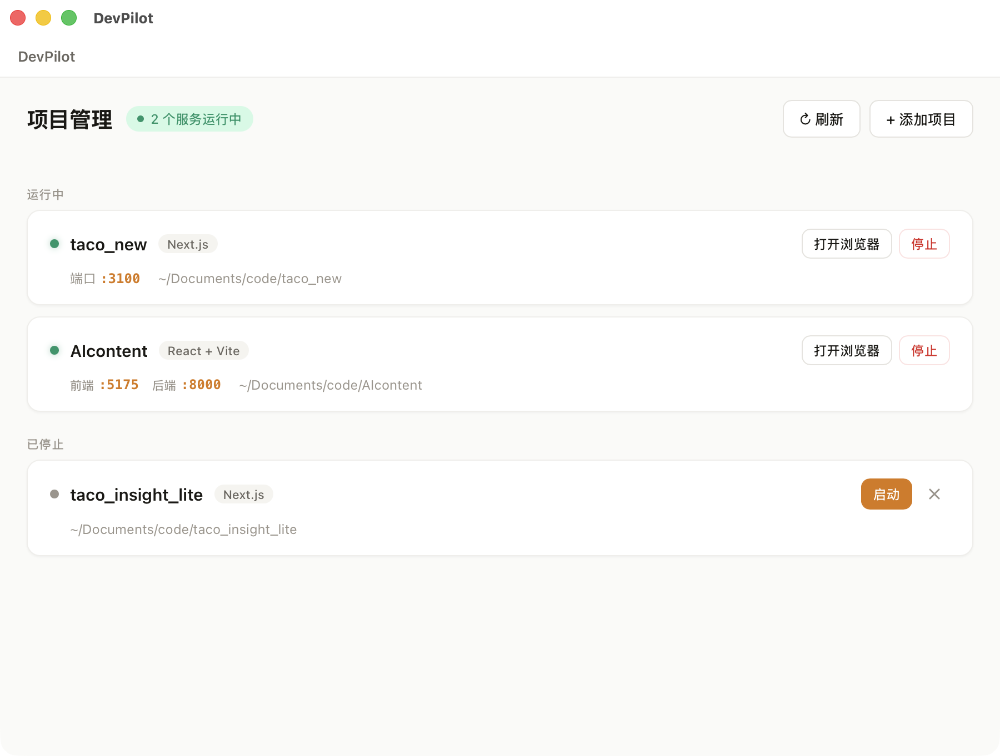

# DevPilot

**用 AI 写代码的人，都需要一个项目管理器。**

你是不是也遇到过这些情况：

- 用 Cursor、Claude Code、Codex 同时开了好几个项目，不知道哪个在跑、哪个没跑
- 想测试一下效果，却不知道该打开哪个网址
- 想关掉某个项目，还得切回编程工具找半天
- 端口冲突了，不知道谁占了 3000 端口

DevPilot 就是来解决这些问题的。

## 它能做什么

**打开 DevPilot，一眼看清全部项目的运行状态。**

- 自动发现你电脑上所有正在运行的项目，不需要手动添加
- 每个项目跑在哪个端口，一目了然
- 点一下就能在浏览器里打开项目，直接看效果
- 不想跑了？一键停止。想重新跑？一键启动。完全不需要打开编程工具
- 前端和后端是同一个项目的？自动帮你合并显示

## 截图



## 下载安装

从 [Release 页面](../../releases) 下载安装包，拖进 Applications 文件夹就能用。

- macOS (Apple Silicon): **4MB**，秒装

> Windows / Linux 版本计划中，敬请期待

## 谁适合用

- 正在用 AI 编程工具（Cursor、Claude Code、Codex、Windsurf 等）做项目的人
- 同时开发多个项目，经常搞混端口和运行状态的人
- 不想为了"看一眼跑没跑"就切换编程工具的人
- 刚开始学编程，被"localhost:3000"搞晕的人

## 从源码构建

如果你是开发者，想自己编译：

```bash
# 需要 Node.js 18+, Rust 1.70+, pnpm
pnpm install
pnpm tauri build
```

## License

[MIT](LICENSE) — 免费使用，随意修改。
